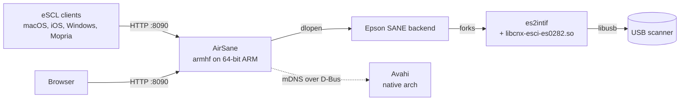

# Scanner Server

Shares a USB scanner with the rest of the network over **AirScan/eSCL**, the
scanning counterpart to AirPrint, plus a web interface for clients that cannot
speak it.

## Installation

1. Plug the scanner into the machine running Home Assistant and switch it on.
2. Install and start the add-on.
3. Check the log. It reports what it found on the USB bus:

   ```
   INFO: Found Epson Perfection V39 II on USB (04b8:013f)
   INFO: Perfection V39 II detected; it is driven by the esci backend and
         firmware esfw0282.bin is pushed to it on the first scan
   INFO: Starting AirSane on port 8090 (eSCL + web interface)
   ```

   If it says no Epson device is attached, the add-on cannot see the scanner.
   Nothing else will work until that line changes.
4. Open the web interface with **Open Web UI**, or go to
   `http://<home-assistant>:8090/`, and press **update preview** on the scanner
   page. That round-trip proves the driver, the firmware upload and the USB
   connection all work, without involving any client.

The first scan after the scanner is powered on takes a few seconds longer than
later ones: the V39 II has no firmware of its own, so the driver has to upload
`esfw0282.bin` before the scanner answers at all.

## Using it

### macOS

The scanner appears on its own. Open **Image Capture**, **Preview → File →
Import from Scanner**, or add it under **Settings → Printers & Scanners**,
where it is listed as a *Bonjour Scanner*. Nothing needs to be installed.

Leave **Correct gamma for macOS** on. macOS interprets every scan with a gamma
of 1.8 baked in and gives you no way to change it, so without the correction
scans come back dark with crushed shadows.

### iOS / iPadOS

Any app using the system scanner picker finds it, as does **Notes → Scan
Documents** when it offers network scanners.

### Windows 10 and 11

**Settings → Bluetooth & devices → Printers & scanners → Add device**. The
scanner shows up as a network scanner; add it, then open it with the Windows
Scan app. Windows allows at most four eSCL scanners in total.

### Android

Install the **Mopria Scan** app. It discovers the scanner by itself.

### Linux

```bash
sudo apt install sane-airscan
```

Add a line `airscan` to `/etc/sane.d/dll.conf` and comment out `escl` if it is
there - only the `airscan` backend understands this server. `scanimage -L` then
lists the scanner, and `simple-scan`, XSane or GIMP can use it.

### Anything else

The web interface at `http://<home-assistant>:8090/` scans to JPEG, PNG or PDF
from any browser.

### File formats

Every client can ask for JPEG, PNG or PDF.

- **PDF** stores each page as JPEG, the same image you get when you ask for
  JPEG, wrapped in a PDF. An A4 colour page at 300 dpi is a few MB. (Stock
  AirSane writes raw bitmaps into its PDFs - about 26 MB for the same page -
  so this add-on patches that; see `patches/`.) Line art, which JPEG cannot
  represent, is still stored uncompressed, but at one bit per pixel that is
  small anyway.
- **JPEG** is the same image without the PDF around it.
- **PNG** is lossless and correspondingly large. Use it when you need every
  pixel exactly, for example archiving photos you intend to edit.

Resolution matters far more than format. File size grows with the square of
it: 600 dpi is four times the data of 300, and this scanner offers up to 9600.
For documents, 300 dpi is plenty; for prints you want to enlarge, 600-1200.

## Options

### `location`

Where the scanner is, for example `Office`. Clients show this next to the
scanner name. Empty uses the host name.

### `web_interface`

Serves the scan page on port 8090. Turning it off leaves the eSCL endpoint
alone, so macOS, iOS, Windows and Mopria keep working.

### `macos_gamma_fix`

Pre-applies the inverse of the gamma macOS bakes into every scan. On by
default. Turn it off if you only ever scan from Windows, Linux or Android,
where it makes images look washed out instead.

### `extra_options`

Raw lines appended to AirSane's `options.conf`, one per list entry, written
verbatim as `name value`:

```yaml
extra_options:
  - resolution 300
  - brightness 10
```

These may be SANE backend options or AirSane's own device options
(`gray-gamma`, `color-gamma`, `synthesize-gray`, `icon`, `location`). To see
what the scanner actually accepts, turn on debug logging and read the option
list the backend reports.

### `debug_logging`

Logs every HTTP request, raises the SANE debug level and creates `/tmp/epson`,
which is the only thing that makes Epson's own driver write its trace (to
`/tmp/epson/epsonscan2/epsonscan2.log`). Noisy. Use it to work out why a scan
fails, then turn it off.

## Supported scanners

Verified with the **Epson Perfection V39 II** (USB `04b8:013f`).

Other Epson models covered by Epson Scan 2 are very likely to work - the add-on
ships the whole driver, firmware blobs for six scanner families included - but
they are untested. Non-Epson scanners are not supported: the standard SANE
backends are deliberately switched off so the proprietary driver cannot be
confused by them.

## How it works, and why it is built this way

The V39 II is not supported by any open SANE backend. Despite the name it is
not a V39 in a new case: it has a different USB product ID (`013f` against
`013d`) and a different firmware blob, so every guide and package written for
the V39 is useless for it. The only thing that drives it is Epson's own Epson
Scan 2, which comes in two halves - an open source half containing the SANE
backend, and a closed binary half containing `libcnx-esci-es0282.so` and the
`esfw0282.bin` firmware. There is no substitute for the second half.

That closed half is published only for x86_64, i686 and armv7l. **There is no
aarch64 build**, and because there is no source there never can be one. On
64-bit ARM the add-on therefore installs the armhf packages and runs them under
the kernel's AArch32 compatibility layer, which Home Assistant OS enables on
every Raspberry Pi build. Every ELF in the bundle has 64K-aligned segments, so
this also holds on the Raspberry Pi 5, whose kernel uses 16K pages.

A 64-bit process cannot load a 32-bit shared object. So on 64-bit ARM the
whole scanning stack is built and run as armhf - AirSane included - and the
driver is loaded directly, in process:



Avahi and D-Bus stay on the native architecture. AirSane only reaches them
through a socket, and a socket carries no ABI, so the word sizes never meet.

**Do not be tempted to put a `saned` in between to bridge the two word sizes.**
It looks like the obvious solution and it does not work: SANE's network
protocol does not interoperate between a 64-bit client and a 32-bit server.
Device enumeration survives the mismatch - it is mostly strings - so the
scanner shows up and everything appears healthy. Then the first real scan
calls `sane_start`, the two ends desynchronise, `saned` logs
`process_request: bad status 22` with a garbage procnum, and client and server
block reading from each other until one is killed. This was measured: the same
AirSane against a 64-bit `saned` returns a JPEG in about two seconds, and
against a 32-bit `saned` never returns at all.

Keeping one word size end to end also means there is only one SANE backend
list to reason about: `/etc/sane.d/dll.conf`, containing `epsonscan2` and
nothing else.

The riskiest code is still isolated, because Epson isolates it themselves: the
backend does not talk to USB in process, it forks `es2intif` and speaks to it
over IPC. A crash in the proprietary connection plugin takes out that helper,
not the server.

## Troubleshooting

**The log says no Epson device is attached.** The add-on cannot see the
scanner. Check the cable, check that the scanner is on, and check that the
add-on still has USB access in its configuration. USB hubs without their own
power supply are a common cause.

**The scanner page loads but a scan fails with an I/O error.** Almost always
the firmware upload. Power-cycle the scanner, then restart the add-on so the
driver starts from a known state. A blinking lamp on the scanner is normal
during the upload.

**macOS does not list the scanner.** mDNS does not cross subnets or most
guest/IoT VLANs. Confirm the web interface answers on port 8090 from the same
machine first; if it does, the problem is discovery, not scanning.

**Scans from macOS look dark.** Turn on `macos_gamma_fix`.

**Scans from Windows or Android look washed out.** Turn `macos_gamma_fix` off.

**Windows will not add the scanner.** Windows refuses more than four eSCL
scanners; remove an old one first.

## Licensing

AirSane is GPL-3.0. The Epson Scan 2 core is GPL-3.0/LGPL-2.1. The Epson Scan 2
plugin is proprietary and covered by Epson's EULA; the add-on downloads it from
Epson at build time rather than redistributing it. By using this add-on you
accept that EULA.
